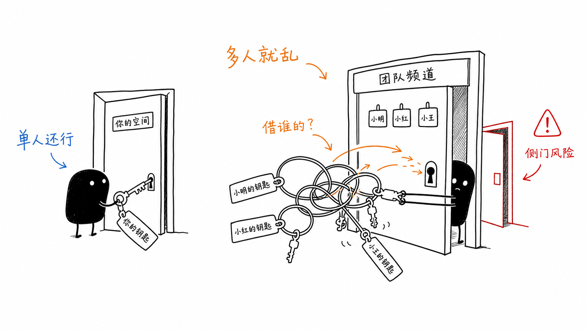
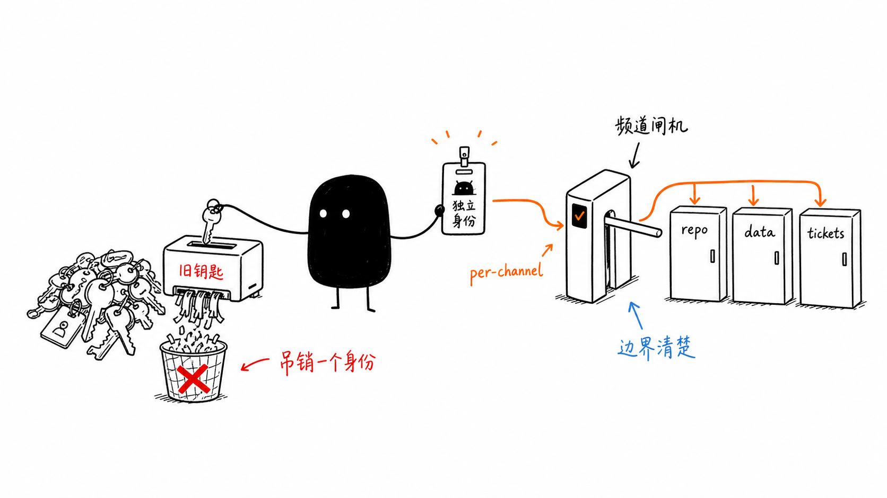

# Claude Tag：当 AI 不再「代表你」，而是「成为它自己」

6 月 23 日 Anthropic 发布了 Claude Tag——一句话说，就是把 Claude 拉进 Slack 当同事：给它开几个频道的权限，接上它该用的工具、数据、甚至代码库，然后频道里任何人 `@Claude` 就能把活派给它，自己去忙别的。它会像 Claude Code 一样把任务拆成几步、逐步做完，做完在 thread 里回你。

如果只看到这一层，很容易把它归类成「又一个 Slack 机器人」。但这篇文章我只想说清一件事：**Claude Tag 真正的新东西，不是 Claude 进了 Slack，而是它换了一套身份模型——AI 不再「代表你」去访问东西，而是「以它自己的身份」行事。** 这件事的分量，比「AI 同事」这个 slogan 大得多。

## 先看官方端出来的东西

Anthropic 给 Claude Tag 列了四个相对「单机版」Claude 的新特性，我按官方表述译一遍，保留它的限定词：

- **`@Claude` 是多人的（multiplayer）。** 一个频道里只有一个 Claude，跟所有人交互。任何人都能看见它在做什么，也能从上一个人停下的地方接着聊。这跟「一个人开一个 chat 做一件事」很不一样，更像在跟一个团队成员协作。
- **`@Claude` 会随时间学习。** 它跟着频道往下读，逐渐攒起对这摊工作的上下文，你不用每次从头解释。在获得授权的前提下，它甚至能从**其他**频道和数据源里自动学习（官方注明：它不会从私密频道里汇报内容）。
- **`@Claude` 会主动出手。** 如果开了「ambient」（环境感知）行为，它会主动同步它认为你可能需要知道的信息——比如从它所在频道和接入工具里挑出相关情报，或者追一追那些没人收尾、悬在那儿的 thread。
- **`@Claude` 异步工作。** 派给它一个任务你就能去忙别的；它还能给自己排期，用几小时甚至几天自主推进一个项目。Anthropic 说他们内部现在「花在并行委派给许多个 Claude 上的时间，比以前多了不少」。

官方还给了一组很容易被当成营销话术、但其实信息量很大的数字：**今天 Anthropic 产品团队 65% 的代码，是由他们内部版本的 Claude Tag 写的**；而且这套用法早就溢出了工程，他们现在也 `@Claude` 去追产品指标和数据、处理 support ticket、甚至帮忙定位刁钻 bug 的根因。「tag `@Claude`」据官方说已经是他们内部把事情做完的主要方式之一。

落地约束也值得记一笔，免得读者高估「现在就能玩」：今天只在 **Claude Enterprise / Team** 客户里开 beta，先上 **Slack**，跑在 **Opus 4.8** 上；它会**替换**掉原来的「Claude in Slack」应用，管理员有 30 天窗口可以选择迁移。**普通个人用户暂时碰不到。**

## 痛点不在「能不能进 Slack」，在「进去之后用谁的权限」

为什么我说重点不是「AI 同事」这个壳子？因为把机器人塞进 Slack 这件事，几年前就有人做了。真正卡住「AI 当同事」的，从来不是聊天界面，而是**身份和授权**。

你平时把 Claude 当个人助理用，授权模型很直白：你接上自己的 Google Drive、GitHub、日历，模型**借用你的权限**去读写——它本质上是「以你的名义」在动作（act as the user）。单机、单人，谁的活谁授权，清清楚楚。

但 Anthropic 在那篇 [agent identity 的博客](https://claude.com/blog/agent-identity-access-model)里点破了：这套「代表用户」的模型，搬到 Claude Tag 上会直接散架，原因有两个，而且都不是 Slack 特有的，是**所有想长出自主性的 agent 迟早会撞上的墙**：

**第一，agent 越来越自主。** 它现在会给自己排明天的任务，会在你早就下线之后响应一个事件继续干活。问题来了：如果它动作的那一刻，「那个人」根本不在场、甚至那条凭据的主人已经离职了，它到底是「代表谁」在访问数据库？「以你的名义」这套逻辑，前提是「你」一直在回路里——而自主 agent 恰恰要把人移出回路。（顺带一提，官方引用了一个数字来佐证这个趋势：AI agent 能可靠独立完成的任务时长，**大约每四个月翻一倍**。这是 [METR](https://metr.org/blog/2025-03-19-measuring-ai-ability-to-complete-long-tasks/) 的测算——六年的长期趋势约是每 7 个月翻倍，而 2024–2025 这一段加速到了约 4 个月。任务越来越长，意味着 agent 脱离人独立运行的时间窗口越来越宽，「人在回路」的假设越来越站不住。）

**第二，多人团队。** Claude Tag 把 Claude 放进一个本来就有人在干活的共享空间——比如一个频道里三个工程师加一个 PM 正一起 debug。这时候谁来「借权限给它」？没有任何一个人的权限，是「在所有时刻都对」的。更糟的是，如果它借了某个人的凭据，那这个共享频道就成了一扇**侧门**：别人能借 `@Claude` 之手，碰到本不该看见的私人文档。

## 它的答案：让 Claude「成为它自己」

Anthropic 给这两个问题的解法，就是这篇文章想让你记住的那个词——**agent identity（代理身份）**：

> 在一个开了 Claude Tag 的频道里，Claude 不是在替某个用户行事。它在每一个接触到的系统里，**都有自己的账号**：它在 Slack 里以 Claude app 的身份发言，以 Claude GitHub App 的身份开 PR，用管理员配的 service account 去查你的数据仓库。

一句话翻译：**权限从「per-user」搬到了「per-channel」。** 管理员在 workspace 层定义一个基线身份（Claude 到哪儿都带着的那套连接和 skills），每个频道默认继承，再按需在频道层覆盖——给工程频道开 GitHub 和数仓写权限、把某个 CRM 连接锁死在一个私密频道里。管理员定义的东西包括：能读写哪些 repo、用哪些 connector（同一个服务可以在不同频道挂不同权限级别的 API key，比如通用频道只读数仓、数据团队私密频道才给写）、加载哪些 skills/plugins、每个频道的常驻 instruction。

这个模型有两个我觉得最关键的副作用，恰恰是「代表用户」模型给不了的：

1. **共享频道再也不会变成某个人私密文档的侧门**——因为根本没有个人凭据参与，没有侧门可走。
2. **撤权变成一个动作。** 想切断 Claude 的访问，吊销它那个身份，它在所有用过这个身份的地方就**同时断了**。这比「跨几十个用户账号去逐条审计某个 agent 干过什么」省太多事。

配套的治理也是按这个粒度来的：管理员能给组织和单个频道分别设 token 花费上限，能看到一份「`@Claude` 干过的所有事 + 每件事是谁派的」的日志。注意这个细节——审计的主语是「Claude 这个身份」，不是「某个被它借用了权限的人」。身份独立了，问责才独立得了。

## 作者点评：这是 agent 长出「主体性」的必修课

我自己在做 Agent 基础设施，对这块的体感是：**身份和授权，才是 agent 从「工具」走向「主体」时真正难啃、也最容易被低估的那一关。** 模型能力、工具调用、上下文管理，这些大家都在卷；但「这个 agent 以什么身份、在谁的授权下、对谁负责地动作」，长期是个被绕过去的问题——因为「act as the user」太顺手了，单机单人场景下它甚至感觉不到是个问题。

Claude Tag 的价值，在我看来不在那个 `@Claude` 的交互壳子，而在它**逼着把这关正面解掉了**：一旦你想让 agent 异步、自主、在多人空间里长期驻留，「借人类的身份」这条路就必然走死，你被迫给它一个独立身份。这其实和业界这两年在讲的 **non-human identity（非人身份）**、给 agent / service 发独立凭据并独立治理，是同一个方向——Anthropic 只是把它做进了一个普通团队每天都在用的产品形态里，让「给 AI 发工牌」这件事第一次变得具体可操作。

当然也别急着神化。真正的考验在落地之后：per-channel 的权限边界，在一个几百号人、频道嵌套混乱的真实组织里，会不会迅速劣化成「为了省事全开成超级权限」？ambient 的主动行为，是帮手还是新的噪音源？这些官方原文都没法回答，得等它真正铺开、有人摔过坑才知道。但**身份模型这一步的方向，我认为是对的，而且是 agent 生态绕不过去的一步。** 「代表你」是 AI 当工具时的逻辑；「成为它自己」，才是 AI 当同事时的逻辑。

---

*本文基于 Anthropic 官方两篇原文整理：[Introducing Claude Tag](https://www.anthropic.com/news/introducing-claude-tag)、[Agent identity: a new access model](https://claude.com/blog/agent-identity-access-model)。所有官方数据与限定词均按原文保留。*
