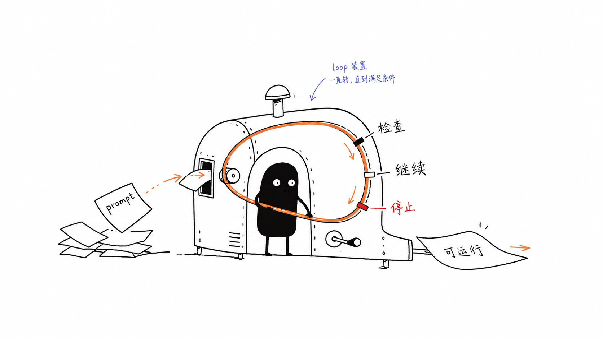
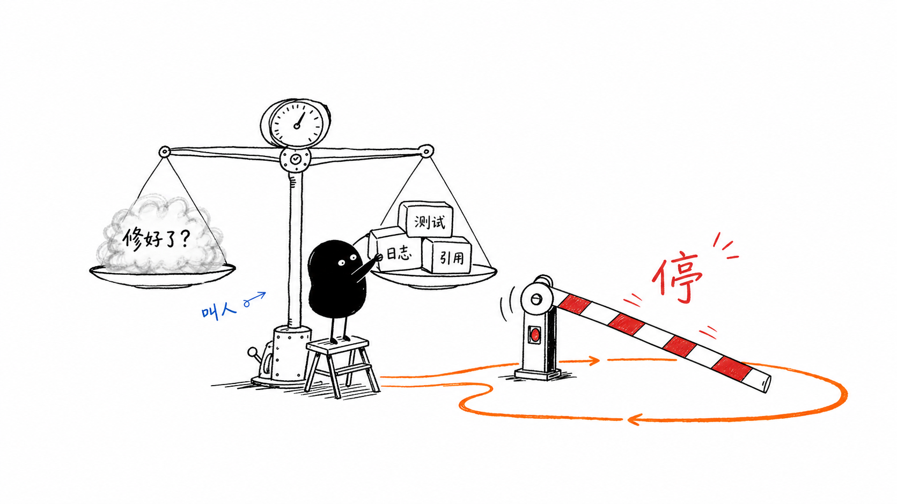
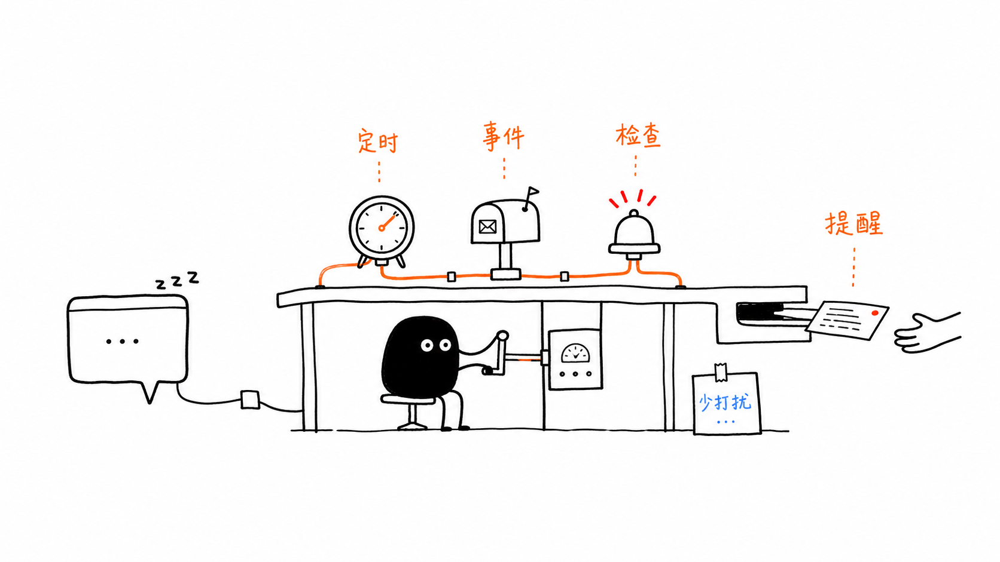

# Claude Loops：Agent 开始有了运行时

最近如果你在用 Claude Code 或者类似的 coding agent，大概率已经习惯了这种节奏：

你给它一个任务，它做一轮，停下来等你看；你说继续，它再做一轮；你发现方向偏了，再把它拉回来。

这套交互很像把一个聪明的人叫到桌边，一起盯着屏幕改东西。它比普通 chat 强很多，但底层仍然是回合制的：人负责触发，模型负责执行；人负责判断下一步，模型负责补全下一步。

Anthropic 这篇《Getting started with loops》有意思的地方，在于它把这件事往前推了一步。

官方没有只讲“Claude 又能自动做更多事了”，而是给出了一个更系统的说法：loop。它们把 loop 定义为 agent 重复执行工作周期，直到满足 stop condition。换句话说，Claude 不再只是“回答一次”，而是在一个有边界的循环里持续工作。

我觉得这篇值得单独写，不是因为它介绍了几个新命令，而是因为它透露出 agent 产品正在发生的一个变化：

过去我们在设计 prompt，现在开始设计运行时。

prompt 决定模型这一轮怎么想；loop 决定模型什么时候启动、什么时候继续、什么时候停、怎么证明自己该停。

这已经不是“会不会写提示词”的问题，而是“怎么把一个 AI 放进真实工作流里，让它持续、可控、可验证地跑起来”的问题。

## 四种 loop，其实是在交出四种控制权

Anthropic 在文中把 loop 分成四类：turn-based loop、goal-based loop、time-based loop、proactive loop。

表面看，这是四种使用方式。往深一层看，它们真正区分的是：人把哪一部分控制权交给系统。

第一类是 turn-based loop，也就是我们最熟悉的回合制。

你问一句，Claude 做一轮；你再确认，它再继续。这个模式的优点是控制感强，适合探索、澄清和高风险判断。缺点也很明显：每一步都要人来推。只要你不发下一条消息，agent 就停在那里。

第二类是 goal-based loop，对应 Claude Code 里的 `/goal`。

你不是只让 Claude 做下一步，而是给它一个目标，再让它自己循环推进，直到达到停止条件，或者达到最大轮次。官方给的例子是把首页 Lighthouse 分数提高到 90 以上，最多尝试 5 次。

这里关键不是“目标”，而是 stop condition。没有 stop condition 的自动化，最后很容易变成“模型一直忙，看起来很努力，但你不知道它什么时候算完成”。goal-based loop 的核心，是把“完成”的定义提前变成可检查的边界。

第三类是 time-based loop，对应 `/loop` 和 `/schedule`。

这更像定时任务：每隔一段时间检查一次状态，发现变化就处理。比如每天早上总结 Slack 消息，或者每 5 分钟检查一次 PR，有 review comment 就处理，有 CI 失败就修。

`/loop` 跑在你的电脑上，电脑关了就停；`/schedule` 则把这类循环移动到云端 routine。这个差异很重要，因为它意味着 agent 不再只存在于一次会话里，而开始进入长期运行的系统。

第四类是 proactive loop。

它不是等你实时叫它，而是在事件或时间触发下自己启动。官方把它放在更完整的组合里：`/schedule` 负责触发，`/goal` 定义完成标准，skills 记录验证方式，dynamic workflows 编排多个 agent，auto mode 让 routine 不必每一步都停下来请求许可。

这类 loop 最接近我们想象中的“主动 agent”。但 proactive 也最危险。因为一旦 AI 主动，它就不只是执行者，还是筛选器和打断源。它要判断什么重要、什么时候该说、说到什么程度。这背后需要非常强的边界设计，否则“主动”很容易从助理变成噪音。

所以四类 loop 真正改变的，不是 Claude 多了几个命令，而是人和 AI 的分工被重新拆开了：

- turn-based loop：人仍然掌握每次触发；
- goal-based loop：人交出一部分“下一步怎么做”和“何时算完成”；
- time-based loop：人交出“什么时候启动”；
- proactive loop：人进一步交出“什么事情值得启动”。

这就是控制权的重新分配。

## 最容易被低估的是停止

很多人第一次理解 agent，会天然关注“它能不能自己多做几步”。

但真正做过自动化的人都知道，最难的往往不是开始，而是停止。

一个脚本跑完就退出，很简单。一个人做事，累了会停，困惑了会问，卡住了会找同事。可一个 agent 如果被放进 loop 里，它需要一种机器可执行的“停”的定义。

比如“修好 bug”不是一个好的停止条件，因为模型可能不知道什么叫修好。

“相关测试通过，lint 通过，改动范围只包含这三个文件，并且没有删除用户未提交改动”就好得多。

比如“帮我研究这个主题”也不是一个好的停止条件。

“产出一篇 2000 字以内的文章，包含三个可查证来源、一个核心判断、一个反直觉点，并且没有 TBD 占位符”就更像一个 loop 能执行的边界。

这也是我做 Agent 基础设施时越来越强烈的感受：prompt engineering 关心“这一轮怎么让模型答得好”；harness engineering 关心“把模型放进一个流程后，怎么让它反复运行仍然可靠”。

loop 其实就是 harness 的产品化入口。

它把一次 agent 执行拆成了几个更工程化的问题：

- trigger：它因为什么被唤醒？
- context：它每次启动时拿到什么输入？
- verification：它怎么检查自己做得对不对？
- stop condition：它满足什么条件必须停？
- budget：它最多能消耗多少轮、多少 token、多少外部资源？

这些问题看起来没有“模型更聪明”那么兴奋，但它们决定了 agent 能不能从 demo 走进真实工作。

## verification 是 loop 的刹车系统

Anthropic 在 turn-based loop 里专门提到，可以把人工验证步骤写进 `SKILL.md`，让 Claude 更好地自检。比如前端改动不能只看代码编辑成功，还要启动 dev server、打开页面、实际点击、截图、看 console，必要时再跑性能检查。

这点非常关键。

如果没有 verification，loop 只是“多跑几轮”。有了 verification，loop 才变成一个可收敛的系统。

这也是为什么 `/goal` 更适合有明确退出标准的任务。官方文中说，每次 Claude 想停下来时，会有 evaluator model 检查你的条件；如果条件没满足，就把它送回去继续做，直到达成目标或达到你设定的轮次上限。

这里有一个容易被忽略的细节：stop condition 最好是 deterministic 的。

“文章更好看一点”很难判断。

“没有占位符、事实来源可查、标题不超过微信限制、摘要不超过微信限制”就容易判断。

“代码质量提升”很难判断。

“新增测试在修复前失败、修复后通过，现有 typecheck 和 guard 通过”就容易判断。

做 loop 的时候，真正需要写清楚的不是一句更漂亮的 prompt，而是一套能让系统自己接近答案、发现偏差、及时停止的检查机制。

这就是 agent 从“会做事”走向“能长期被托付”的分界线。

## time-based loop 会让 agent 变成基础设施

我自己看到 time-based loop 时，第一反应不是“酷”，而是“这就是基础设施化的开始”。

因为一旦 AI 可以按时间运行，它就不再只是聊天窗口里的能力，而开始接近 cron、CI、监控、日报、值班系统这些东西。

我在自己的内容流水线里已经踩过类似问题：每天定时抓取官方动态、生成中文摘要、渲染卡片、提交分支、触发自动合并；另一路还要每小时监控一手信源，发现新文章就生成摘要、去重、开 PR、追加评论通知。

这些事情看起来是“让 AI 写内容”，但真正难的不是写那几段文字，而是：

- 输入从哪里来？
- 去重的唯一真相放在哪里？
- 哪些改动可以自动合并，哪些必须人工 review？
- 失败摘要怎么补修？
- 同一天多批内容怎么追加到同一个分支，而不是刷屏？
- 推送失败到底是权限问题、网络问题，还是内容不符合 guard？

这已经不是 prompt 问题，而是系统问题。

当 agent 只在你点开聊天窗口时存在，它更像一个工具。

当它每天 7 点自动运行、每小时检查状态、发现异常主动通知、能把结果写回仓库或草稿箱，它就已经是系统的一部分。

而系统的一部分，就必须接受系统工程的约束：日志、权限、幂等、去重、回滚、审计、预算。

官方在 token usage 部分也讲到了这一点：选择合适的 primitive 和 model，定义清楚 success 和 stop criteria，大规模运行前先 pilot，用脚本处理确定性工作，不要让 routine 以高于实际变化频率的间隔运行，并通过 `/usage`、`/goal`、`/workflows` 查看不同 skills、subagents、MCPs 和 workflows 的 token 消耗。

这说明 loops 不是“让模型无限循环”，而是把循环纳入资源管理。

一个没有预算意识的 loop，不是自动化，是持续烧钱的黑盒。

## 从 ReAct 到运行时控制面

我之前在准备 Agent 架构问题时，有一个判断对这篇文章也适用：Claude Code 这类工具更接近 ReAct，把相当多的控制权交给 LLM；LangGraph 这类框架更接近 Flow Engineering 或状态机，把控制流收回工程基建侧。

这个对比不需要在本文展开成框架评测，但它能帮助理解 loops 的位置。

loop 不是简单站在两者中间，而是在给 ReAct 型 agent 补一个运行时控制面。

ReAct 的好处是泛化能力强，模型能根据上下文动态决定下一步。坏处也很明显：如果缺少外部边界，它可能过早停止，也可能陷入低质量迭代，甚至在不该继续的时候继续。

状态机的好处是确定性强，每一步从哪里来、到哪里去都被工程系统写死。坏处是灵活性下降，很多开放任务很难提前穷举路径。

loops 的价值在于，它不急着把所有路径都写成状态图，而是先抓住运行时最关键的几个控制点：触发、停止、验证、预算、升级给人。

这几个点一旦清楚，agent 就不再只是“一个会调用工具的模型”，而是一个可以被调度、被观察、被中断、被审计的执行单元。

从这个角度看，loop 更像操作系统里的调度器。

模型是智能的 CPU，tools 是外设，context 是内存，skills 是可复用的操作手册。

那 loop 决定什么？

它决定任务什么时候被唤醒，什么时候继续跑，什么时候被挂起，什么时候退出，什么时候把控制权还给人。

## 读者真正该带走什么

如果只把《Getting started with loops》当成 Claude Code 的功能教程，它当然也成立。你可以去学 `/goal`、`/loop`、`/schedule`，再研究 proactive routines 和 dynamic workflows。

但我更愿意把它看成一个信号：agent 产品正在从“对话界面”往“运行时系统”移动。

未来我们不会只问：

这个模型会不会调用工具？

我们会越来越多地问：

它能在什么 loop 里运行？

它怎么验证自己的输出？

它什么时候停？

它被什么触发？

它主动找人的边界在哪里？

它留下什么日志，谁能审计？

这些问题听起来没有“更强模型”那么直接，但它们决定了 agent 能不能进入真实工作。

AI 的下一步，不只是更聪明地回答你。

而是更可靠地在一个流程里运行。

我们以前学的是怎么写一句好 prompt。

接下来要学的，是怎么设计一个好 loop。

---

资料来源：Claude 官方博客《Getting started with loops》（2026-06-30）。本文仅基于可查官方资料和作者自己的 Agent 基础设施实践整理；具体命令、开放范围与产品行为，以 Claude 官方文档和实际产品为准。
