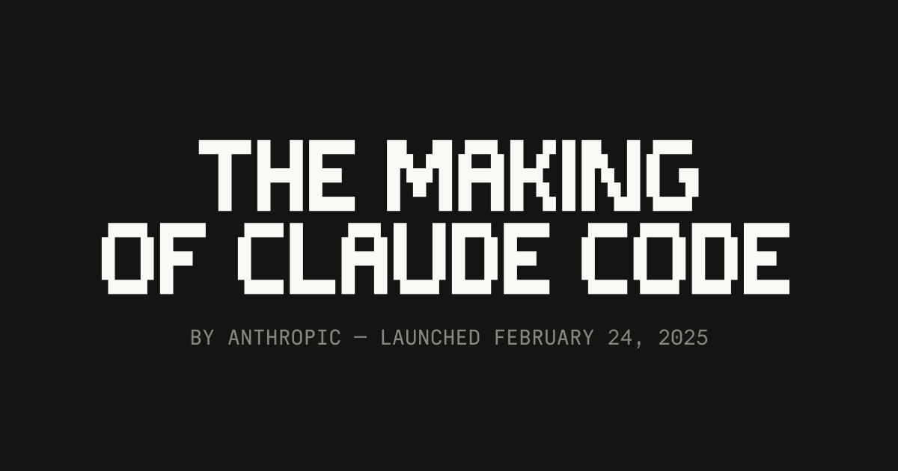
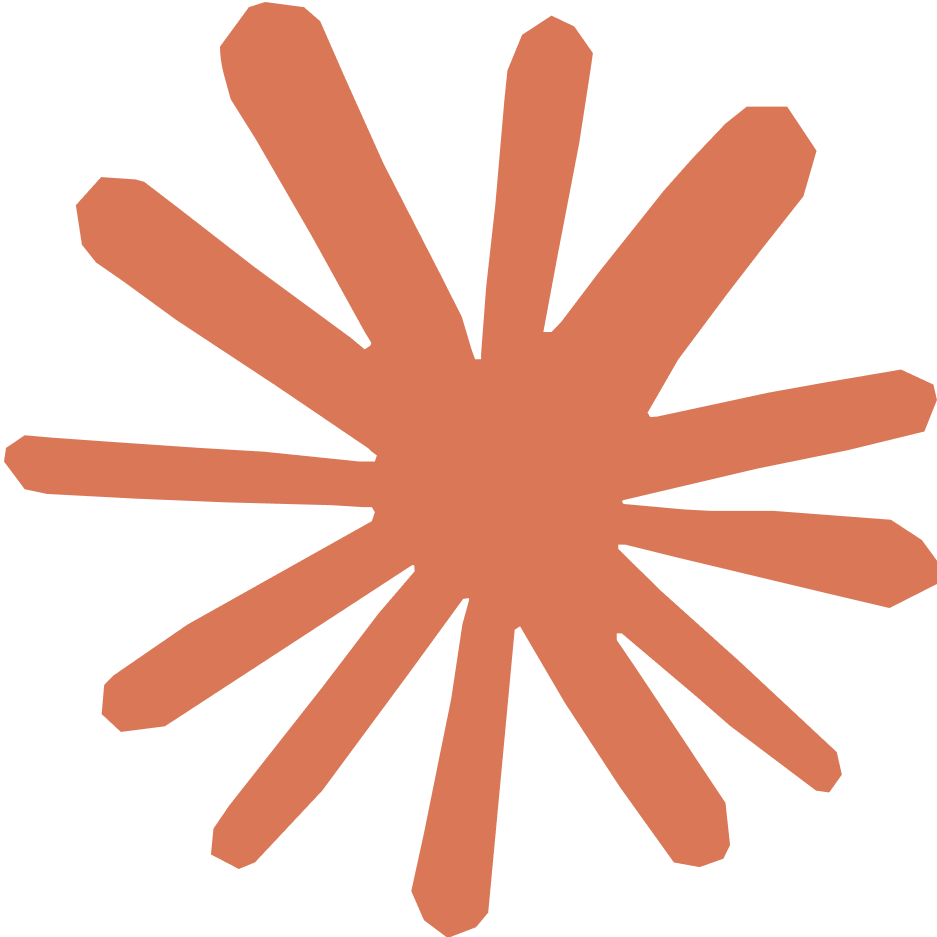
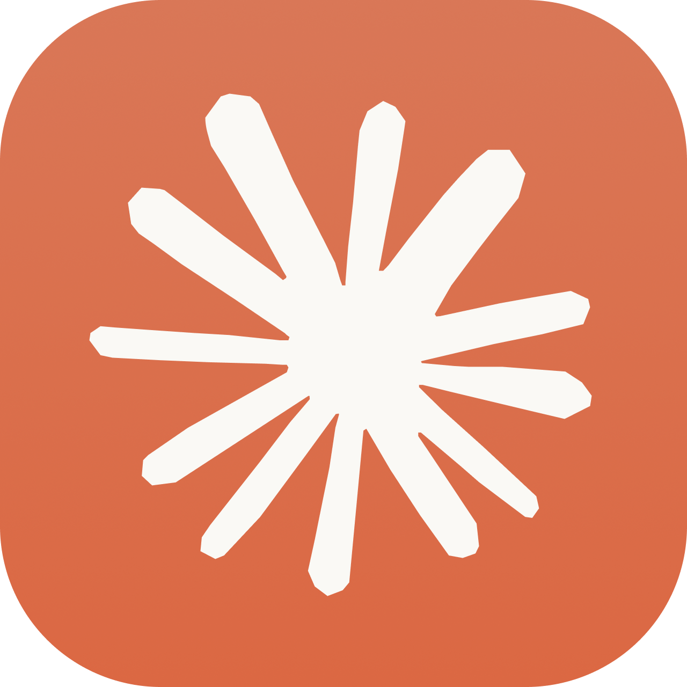
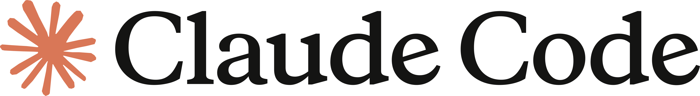

# 配图候选

## 推荐首图

- 文件：`assets/making-of-claude-code-og.gif`
- 来源：Anthropic 原文页 Open Graph 图片
- 原始 URL：`https://cdn.sanity.io/images/4zrzovbb/website/bfd4aa0ef6a657e6f22fe214dc177aeff4c4c247-1200x630.gif`
- 用法建议：作为公众号正文首图或题图。它和本文主题最贴合：黑底、像素字、Claude Code 官方标题视觉。
- 备注：这是文章原始官方视觉素材，使用时建议在文末保留原文链接和图片来源说明。

## 备选装饰图

- 文件：`assets/claude-spark-clay.png`
- 来源：Anthropic press kit / Claude logos / Claude Spark
- 用法建议：可放在正文第一屏附近，作为 Claude 官方视觉符号；也可用于自制简洁题图。

- 文件：`assets/claude-icon-rounded.png`
- 来源：Anthropic press kit / Claude logos / Claude icon
- 用法建议：更像产品 icon，适合小尺寸引用，不建议作为整篇文章主图。

- 文件：`assets/claude-code-logo-slate.png`
- 来源：Anthropic press kit / Claude logos / Claude Code logo
- 用法建议：适合页尾或题图里横向搭配标题，不建议单独作为封面，因为画幅太横。

## 不推荐直接使用

- Sticker Mule 上有 `Clawd happy`、`Clawd Kite`、`Clawd Coffee`、`Clawd Headphones` 等贴纸页，显示为 “by Claude Code”。
- 这些图很可爱，也更像“贴图”，但不在 Anthropic 官方 press kit 里，授权和二次使用边界不如官网 / press kit 清楚。
- 公众号正文若要稳妥，建议只作为灵感参考，不直接下载或嵌入。
